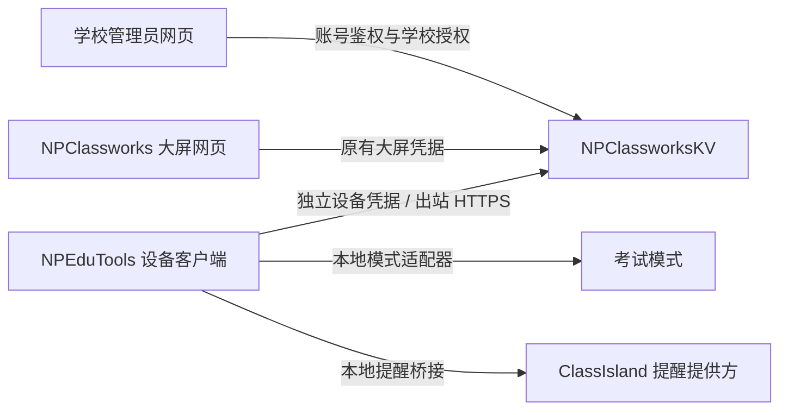

# NPEP 服务端发现与首阶段对接提案

日期：2026-09-20。状态：**架构对齐草案，尚未实施、尚未冻结协议**。

范围：学校管理授权 NPEduTools 切换考试模式，以及将 NPClassworks 通知交由 NPEduTools / ClassIsland 提醒提供方展示。本轮仅阅读前后端源码，新增本文档，不改变业务代码、数据库、部署代理或生产配置。

审查基线：NPClassworks `472cefeacfafe8598901fa8e1ef10759164f18d0`；NPClassworksKV `151f70358b01f046c136ae961f64b060bd29bf82`。本地执行能力、UAC 和 ClassIsland 提供方的实际接口由 NPEduTools 任务核实；本文不推定它们支持无人值守切换或真实展示回调。

已与 [NPEduTools 基础草案](../../NPEduTools/docs/NPEP-FOUNDATION-PLAN.md) 对齐：该端观察基线为 `ca75bc3`。实施前两端重新核对远端与发布修订；本报告的字段名、路由和状态枚举仍是提案，须汇总成一份共同契约，不分别实现。`commandId` / `operationId`、`bindingRevision` / `bindingEpoch` 等命名差异在契约冻结时统一。

## 1. 建议先达成的共识

- NPClassworksKV 是学校授权、设备绑定、命令状态和通知可见性的服务端入口；学校管理网页用于操作和查看结果。
- NPEduTools 直接出站访问 HTTPS API。浏览器关闭后仍能领取已授权任务，不依赖作业板网页作为在线中继，也不要求给教室设备开放入站端口。
- 浏览器大屏身份与本地设备执行身份分开。已有 screen token 不换取、不直接充当 NPEP 设备凭据；本地执行端不保存学校管理员账号令牌。
- 第一阶段只试点单设备、显式切换考试模式及通知转发，不加入脚本执行、任意程序启动、文件操作、批量全校切换或自动排考。
- 界面分别展示命令已创建、设备已接收、等待现场处理、执行失败与实际完成。UAC、未保存编辑、录制等阻碍必须如实报告，不能把已发送写成切换成功。
- 考试模式指 NPEduTools 本地产品模式，不因此宣称具备操作系统级锁定或防作弊能力。

图中所有 NPEP 接口与适配器均是待实现提案；原有大屏网页不是设备控制链路的必要节点。

## 2. 当前代码可以复用什么

| 能力 | 源码依据 | 已有语义及复用边界 |
| --- | --- | --- |
| 学校管理授权 | `services/academicAuthorizationService.js`：`assertSchoolManager`；`routes/v2/academic-admin.js` | 查询实际 SchoolMember，仅 OWNER、ADMIN 为学校管理员。可复用学校归属及角色判断，但需要在 NPEP 命令写事务中再次核验，不能只靠网页隐藏按钮。 |
| 账号会话 | `middleware/jwt-auth.js`；`utils/tokenManager.js`：`validateAccountToken` | 新令牌校验 tokenVersion，含 sessionId 时校验持久化会话及撤销；另有旧令牌兼容路径。建议 NPEP 高权限管理操作要求当前可撤销会话，不自动继承旧令牌兼容资格。 |
| 大屏绑定及可见范围 | `services/classroomScreenService.js`；`prisma/schema.prisma`：ClassroomScreenBinding | 绑定学校、行政班，包含 tokenHash、credentialVersion、启用状态。认证还检查班级和学期有效性；走班范围由服务端按规则展开。可复用归属与范围规则，不复用 bearer token 权限。 |
| 大屏写入撤销保护 | `services/screenWriteAuthorization.js`：`lockClassroomScreenWrite` | 在事务中锁定并复查 tokenHash、credentialVersion、isActive 和行政班。可借鉴并发核验方式，为新设备凭据建立自己的锁和撤销逻辑。 |
| 轻量浏览器指令 | `services/classroomScreenDutyService.js`；`routes/v2/classroom-screens.js` | 仅允许 REFRESH_DATA、RELOAD_APP。心跳每批最多领取 10 条、创建时有效期 15 分钟，PENDING / DELIVERED 会重投。适合参考，不是可直接复用的本地控制协议。 |
| 实时失效提示 | `utils/socket.js`；`services/publicationService.js`：`emitPublicationEvent` | 事件携带标识、版本等信息，正文通过 HTTP 获取；join-workspaces 只检查工作区有效性，没有账号或设备认证。只能借鉴“事件提示后重新拉取”模式，禁止在这些公开房间广播控制命令或设备秘密。 |
| 通知可见性与版本 | `services/publicationService.js`：`listPublishedFeed`；Publication / PublicationRevision | 使用 publicationId、revision、目标教学空间、PUBLISHED、publishAt 与 expiresAt 判断通知可见性；有 nextTransitionAt，可提示定时发布或到期后重新读取。可复用查询规则，不把 Socket 事件视为最终授权。 |
| 大屏通知回执 | `services/notificationDeliveryService.js`；`domain/notificationDelivery.js` | 回执区分 receivedAt、displayedAt、acknowledgedAt。按绑定与通知保存当前 revision，同版本状态单调前进，新版重置旧确认；写事务重新核验凭据与通知版本。不能据此声称 ClassIsland 已展示。 |
| 审计 | `services/auditLogService.js`；AuditLog | 已有脱敏和学校审计查询。通用 HTTP 审计在响应完成后异步写入，失败只记录日志；新命令及关键状态事件建议事务内持久化，不将此中间件当作完整的可靠命令日志。 |

### 需要特别分开的三个概念

1. **学校账号**：能否向指定学校、指定设备下发操作。
2. **网页大屏绑定**：作业板浏览器可查看和录入哪些班级数据。
3. **NPEP 安装实例**：哪一个本地客户端有权领取指定设备任务、报告状态和接收通知。

`deviceFingerprint` 是现有绑定辅助字段，不是硬件身份凭证。复制浏览器存储、知道工作区 ID、能加入 Socket 房间，都不能成为本地执行权限的证明。

## 3. 当前机制的不足，不作为 NPEP 已具备的保证

- 现有心跳在取命令时标记 DELIVERED，表示本次响应准备投递，既不证明客户端已收到，也不证明执行完成。浏览器 RELOAD_APP 在实际刷新前发送成功回执，更不能类推为模式切换结果。
- 现有命令回执只有 success 与最多 500 字 message，没有执行阶段、状态序号、幂等请求键、执行租约、能力版本及实际模式。回执更新也不是针对 NPEP 状态机设计的比较交换。
- 现有指令创建先检查管理员和绑定，再单独创建记录；心跳、命令回执没有复用 `lockClassroomScreenWrite`。不应将其作为“鉴权后撤销仍绝对不会执行”的现成保证；本文未进行该路径的并发漏洞复现。
- NotificationScreenDelivery 主键是 `(publicationId, screenBindingId)`，没有提醒通道或本地安装实例维度，也不是全版本事件账本。直接写入会把网页和 ClassIsland 结果混在一起。
- 当前通知回执服务核验当前 revision、PUBLISHED 和目标范围，但回执写入处没有再次要求 publishAt 已到或 expiresAt 未过期。它不能直接充当新设备“现在可以弹出”的授权判定；离线晚到的事实回执与当前展示权限需分别定义。
- 设备断网、进程退出或权限撤销后的实际本地状态，服务端不能凭缓存推断。状态页应展示最后观测时间，过时状态标记未知或离线。

## 4. 首阶段设备身份与授权提案

建议新增独立的 NPEP 设备记录，关联学校、行政班和安装实例；首阶段按双方草案关联已有 screenBindingId，是否强制一对一在 N0 确定。不共享令牌、最后在线时间或权限，后续也不把浏览器重装等同于本地客户端重装。

配对建议采用现场客户端生成安装身份、显示短时配对请求，管理员在本校页面核对后批准、现场再次确认的流程。配对完成前明确显示学校、班级、设备名称和将开放的能力，状态查询、通知、模式切换分别授权；短码需限次、防猜测、短时有效、一次消费，并绑定原申请实例。不能仅凭大屏 PIN 或未认证 fingerprint 自动领取设备控制凭据。

设备持久凭据与短期访问凭据的具体形式待两端冻结，可采用独立高熵随机秘密与服务端哈希校验方案，或经明确设计的设备密钥方案。本地凭据应由 NPEduTools 使用 Windows 受保护存储，不落入网页 localStorage、日志、URL 或通知正文。设备凭据只允许领取自身任务、读取自身通知范围和回报自身结果，不能创建管理命令或管理学校。

建议维护 credentialGeneration 与 bindingRevision：解除配对、停用、重装换身份、改绑班级时递增并撤销旧任务资格。默认停止旧范围未执行任务，重新配对/授权后才恢复；是否由浏览器“重置设备”联动撤销，需要作为管理页明确行为确定，不静默关联两类令牌。

命令创建事务同时核验当前会话、学校角色、设备归属、启用状态和能力，并保存操作者及审计事件。设备领取/获取执行许可时再次核验；建议尚未开始的任务在发起人失去授权后取消。锁顺序和注销/降权事务的配合必须在实施时验证，不能用一次查询代替并发保证。

## 5. v0.1 接口草案（命名和字段待共同确认）

以下路径均为**提议的新接口，不是当前已存在接口**；现有 `/api/v2/classroom-screens/*` 保持原义。

| 调用方 | 路径提案 | 目的与限制 |
| --- | --- | --- |
| 本地未配对实例 | `POST /api/v2/npep/pairing-requests` | 申请配对；限频，只返回本申请的短时验证信息，尚无业务权限。申请结果轮询须持有原请求秘密。 |
| 学校管理员 | `POST /api/v2/npep/schools/:schoolId/pairings/:id/approve` | 按当前学校权限和现场核对信息批准；原实例单次领取设备凭据，具体领取协议待定。 |
| 学校管理员 | `GET /api/v2/npep/schools/:schoolId/devices` | 独立显示 NPEduTools、ClassIsland 桥接状态、最后观测时间和已声明能力。 |
| 学校管理员 | `POST /api/v2/npep/schools/:schoolId/devices/:id/commands` | 固定白名单命令，携带 requestId、设备 bindingRevision、有效期和预期模式状态版本。首项建议 `SET_MODE` + `EXAM`，不是 toggle。 |
| 学校管理员 | `GET /api/v2/npep/schools/:schoolId/commands/:id` | 返回持久化状态、最后观测、待现场处理原因；受本校授权限制。 |
| 学校管理员 | `POST /api/v2/npep/schools/:schoolId/devices/:id/revoke` | 撤销设备资格及尚未开始的命令，记录审计；不宣称已停止正在执行的本地动作。 |
| 已配对设备 | `POST /api/v2/npep/device/poll` | 有界长轮询或短轮询，报告心跳、能力与实际模式，返回本设备待领取任务、服务端时间和重新拉取提示；响应条数和体积受限。 |
| 已配对设备 | `POST /api/v2/npep/device/commands/:id/claim` | 获取短执行租约，重新检查撤销、有效期、状态和代际。重复领取有明确结果，不同时交给两个执行实例。 |
| 已配对设备 | `POST /api/v2/npep/device/commands/:id/events` | 以 eventId、sequence、attemptId、lease 身份幂等回报阶段及实际结果，禁止任意倒退或覆盖终态。 |
| 已配对设备 | `GET /api/v2/npep/device/notices` | 只读取本设备当前授权范围内有效通知的最小投影，采用有界完整快照/快照分页，不以混合 feed 的普通分页当作删除同步协议。 |
| 已配对设备 | `POST /api/v2/npep/device/notice-receipts` | 回报独立提醒通道的接收、提供方接受、真实展示、真实人工确认或失败，按项返回 accepted / stale / rejected。 |

### 命令语义

- requestId 在设备与管理操作范围内唯一，同键同内容返回同一命令；同键不同内容返回冲突。服务端生成 commandId，本地持久化执行去重记录，重复投递不重复执行。
- 使用“设置考试模式”而非切换开关。执行前比较预期 modeRevision，返回观测模式和新版本；已在目标模式时可以报告无动作成功，但必须实际检查。
- 建议阶段：QUEUED → ACCEPTED → RUNNING → SUCCEEDED / FAILED；受阻时报告 WAITING_LOCAL，过期未开始为 EXPIRED，尚未开始撤销为 CANCELLED。ACCEPTED 仅表示本地已持久接收。执行中断涉及部分完成或结果未知时另设 PARTIAL / UNKNOWN，不压成普通失败并自动重跑；最终枚举与本地恢复模型一起定稿。
- WAITING_LOCAL 必须携带可理解的原因，例如 UAC_REQUIRED、UNSAVED_EDITOR、RECORDING_ACTIVE、PROVIDER_UNAVAILABLE；不自动关编辑器、终止录制或重试弹出 UAC。现场处理后重新获取有效许可，旧批准不能无限延长执行资格。
- 到期规则以服务端 UTC、连接时测得的时间关系、单调计时和短租约为依据，设备还检查代际和当前有效期。不得使用可手调的 ClassIsland 学校时间判断安全时效；学校时间继续负责课表与自动录课。时钟大幅跳变时重新核对服务端时间。断线不盲目执行缓存中的考试切换命令；重启后先核对命令状态与实际模式。
- 不能承诺分布式 exactly-once 或即时远程撤回。动作已发生、回执丢失时由本地执行日志与模式观测对账；过期后补到的完成事实标记为迟到结果，不伪装成从未执行，也不重新授权执行。
- 控制 payload 只接受固定字段与枚举，不接受 shell、任意 URL、文件路径、启动参数或原始脚本。退避、抖动、Retry-After、401 停止领取与版本不兼容反馈应进入基础协议。
- 同一设备的并发管理员命令、旧租约晚执行、手动本地切换需要明确串行和冲突规则。首阶段建议有未结束命令时拒绝新切换，让操作者先查看或取消，避免自动覆盖意图。

首阶段只描述 EXAM；退出考试模式、NORMAL 的具体枚举和现场恢复方式必须由本端先确认，再决定是否开放远程操作。

## 6. 通知桥接与回执语义

建议通知身份为 `(serverInstanceId, installationId, publicationId, revision, channel)`，其中 channel 如 `classisland`。同版重复拉取不重复提醒；换版是新内容，旧版确认不传递到新版。重装、改绑或切换服务器不能复用旧去重键。

服务端投影至少包含 publicationId、revision、标题/正文、优先级、popupEnabled、publishAt、expiresAt 和撤回/失效同步所需信息。沿用现有通知投放范围、到时发布与到期规则。NPEP 客户端不得自行把次要通知提升成普通通知；提醒能力不支持某等级时明确报告兼容限制。

**首版同步建议先做有上限的完整有效通知快照**：服务端绑定 snapshotId 与 scopeRevision，只有全部页成功才替换本地集合；中途失败保留上次完整集合并标记过时，不能把未取到的分页当成撤回。重新联网先对账后展示；本地依据已知 expiresAt 停止到期内容。若后续使用增量游标，需要独立事件日志、撤回 tombstone、游标过期重同步，不能仅使用 publication.updated Socket 事件或记录 ID 大小推断全部变化。

回执应按通道、安装实例与 revision 独立存储：

| 状态 | 含义 |
| --- | --- |
| RECEIVED | NPEduTools 已持久保存本版通知；不是已显示。 |
| PROVIDER_ACCEPTED | ClassIsland 提供方接受请求；不是保证用户看见。 |
| DISPLAYED | 只有提供方能给出可信的实际展示回调时才填写；没有回调则保留未知。 |
| ACKNOWLEDGED | 只有明确人工确认行为才填写；关闭浮窗、倒计时结束或提交给提供方均不自动算确认。 |
| FAILED / SUPPRESSED / UNSUPPORTED | 单独记录失败、模式策略抑制或不支持；携带固定原因，不冒充成功。 |

不写入现有 NotificationScreenDelivery 来冒充网页大屏回执。管理页可并列显示“网页大屏”和“ClassIsland”通道。旧 revision、撤回或过期后的离线晚到回执，可保留为对应历史版本事实，但不得更新当前版本确认或成为重新显示授权。

对端指出、并已在本地 `ClassIsland/Services/NotificationHostService.cs` 的 `ShowNotification` / `ShowNotificationAsync` 路径复核：`IsNotificationEnabled=false` 时也会取消 `CompletedTokenSource`，而异步方法等待的正是该 token。因此 Completed 或 ShowNotificationAsync 返回都不是 DISPLAYED 证据，更不是人工 ACKNOWLEDGED。考试模式已关闭 ClassIsland 时报告 unavailable，不为展示通知擅自重开它或退出考试软件。N2 先用受长度和频率限制的纯文本测试通知，不绕过本地提醒设置。

通知文字是纯展示数据，不能触发本地命令。考试模式下是否展示普通、重要、紧急提醒，以及 NPClassworks 网页与 ClassIsland 同时运行时谁负责提示音和弹窗，需明确产品策略；没有可靠通道接管与故障恢复协议前，不能简单永久关闭网页提醒。

## 7. 持久化与实施边界

建议独立建模 NpepDevice、DeviceCredential、Command、CommandEvent 和 ChannelNotificationReceipt，名称待实现确定；配对请求短期存储也需明确一次消费与回收策略。不要把新的执行回执塞入 runtimeStatus 或单一 JSON 后就视为可靠队列。

关键唯一约束至少覆盖幂等 requestId、设备命令事件 eventId、回执的设备/通道/通知版本组合；命令写入及关键审计在同一事务，状态更新有版本比较。查询、心跳、租约和通知页数均有上限，保留期限与设备离线后的清理规则待定。

**如果采纳此持久化方案，实施阶段会需要新增数据库迁移。** 本轮未创建迁移；不应沿用 v1.1.5“无新增迁移”的结论。届时核对现有自动部署的迁移入口和向后兼容策略，不预先要求修改朋友服务器上的 `deploy/agent/server.js`。

## 8. 待共同确定的最少问题

1. 本地考试模式的准确含义和 API：切入涉及哪些操作，是否提权，如何检测真实完成，如何现场退出或恢复？
2. Windows 多用户会话、双实例、重装及一班多设备如何区分？首期是否只允许一个交互会话作为执行实例？
3. 配对是否要求现场确认，如何识别目标物理教室？改绑与网页大屏停用/重置是否联动撤销？
4. 学校是否先只开放 OWNER / ADMIN；未来新增“设备控制”委派权限是否另行设计？普通教师和学生默认无命令签发权。
5. 操作有效期、轮询时延、WAITING_LOCAL 的等待期限和提醒频率如何选择？断网时保持当前模式还是采取其他策略？
6. ClassIsland 提供方实际能提供哪些接收、展示、撤回及人工确认回调？不支持的能力怎样展示给管理员？
7. 考试模式下的提醒等级策略，以及网页与本地提醒的去重/接管策略如何定义？

## 9. 建议下一步与验收条件

下一步先由两端共同确定一份小型 v0.1 契约：配对身份、SET_MODE 请求、真实结果枚举、通知投影与回执。不同时启动整套设备平台。

与 NPEduTools 端采用同一顺序：N0 两端研究及共同契约 → N1 隔离环境单设备配对、撤销与只读观测 → N2 单设备纯文本通知 → N3 单设备考试模式 → N4 一间教室有限试点。先验证身份与真实通知回执，再接有副作用的本地模式流程；每一步都能独立关闭，不影响原有作业板流程。

实施验收至少覆盖：非管理员与跨校拒绝、配对重放、凭据撤销与改绑、管理员降权后待执行命令、命令重复投递/响应丢失/崩溃恢复、旧租约晚到、UAC/编辑器/录制阻碍、通知更新撤回到期、长分页中断、离线回执与网页/本地通道并存。验证使用测试账号、隔离数据库和测试设备，不将当前只读代码审查报告称为安全验证通过。
